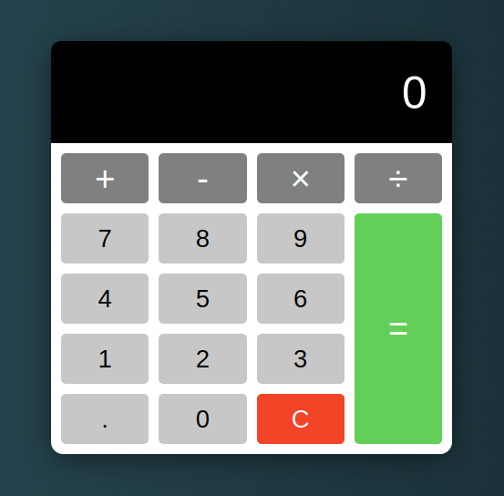

# basicJS_Calculator: [LIVE DEMO](https://shcoobz.github.io/basicJS_calculator/)

## Summary

basicJS_Calculator provides a simple calculator interface for performing basic arithmetic operations. It features a user-friendly interface with buttons for numbers, operators, and a clear function.

The core functionality includes:

- Addition, subtraction, multiplication, and division operations.
- Decimal point support for entering floating-point numbers.
- Clear function to reset the calculator's display and state.

## Features

### Arithmetic Operations

The calculator allows users to perform basic arithmetic operations such as addition, subtraction, multiplication, and division.

### Decimal Point Support

Users can input floating-point numbers using the decimal point button.

### Clear Functionality

The clear button resets the calculator's display and state, allowing users to start fresh.

### Additional Features

- Responsive design ensures the calculator adapts to different screen sizes.
- Keyboard support enables users to input numbers and perform operations using their keyboard.

## Technologies

- HTML5: Provides the structure of the calculator interface.
- CSS3: Styles the calculator interface for a visually appealing design.
- JavaScript: Implements the calculator's functionality, including arithmetic operations and event handling.

---

_Note: This document provides an overview of basicJS_Calculator. For detailed instructions and more information, please refer to the source code documentation._
